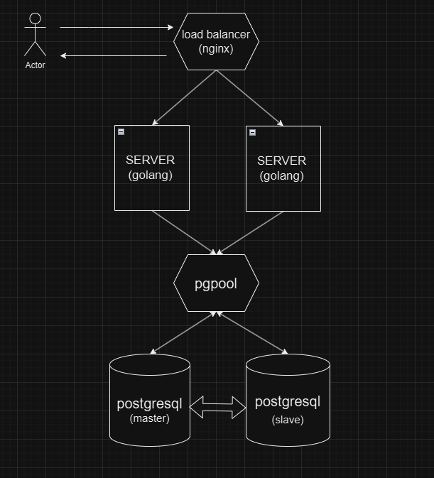
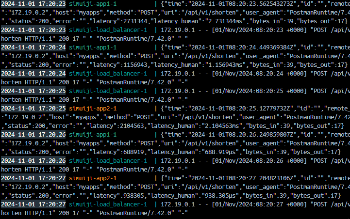
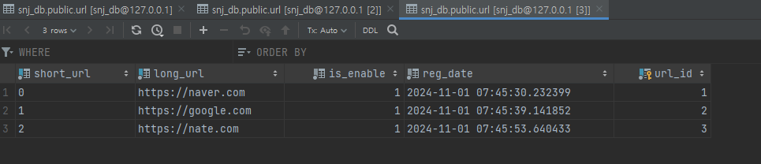
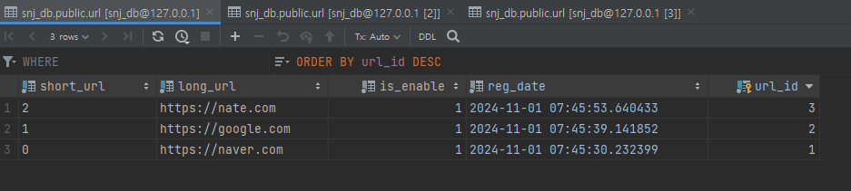
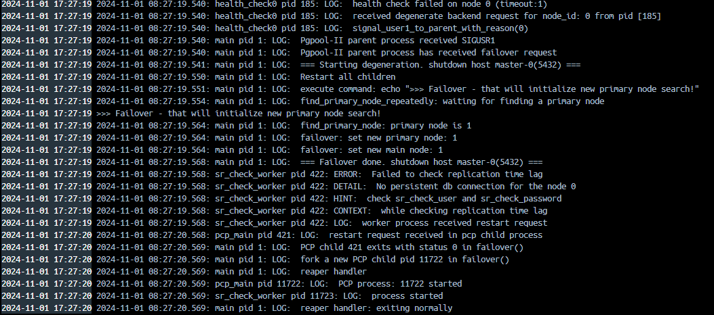
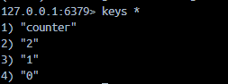

# [가상 면접 사례로 배우는 대규모 시스템 설계 기초](https://www.yes24.com/Product/Goods/102819435)
저자: 알렉스쉬

---

# 8장 URL 단축기 설계

## 기본 기능

- URL 단축
- URL 리디렉션
- 높은 가용성 및 규모 확장성 그리고 장애 감내

## 개략적 추정

- 쓰기 연산: 매일 1억 개의 단축 URL 생성
- 초당 쓰기 연산 1억/24/3600 = 1160
- 읽기 연산: 초당 11,600회
- 10년간 보관 가능한 레코드 개수는 1억*365*10 = 3650억
- 10년간 필요한 저장 용량은 URL 평균 길이가 100일 때 365 Billion*100Byte = 36.5TB

## API 엔드포인트

- URL 단축 엔드포인트
    - Parameter ⇒ 단축할 URL
    - Method ⇒ POST
    - URL ⇒ /api/v1/data/shorten
    - Response ⇒ 단축 URL
- URL 리디렉션 엔드포인트
    - Parameter ⇒ 단축 URL
    - Method ⇒ GET
    - URL ⇒ /api/v1/shortUrl
    - Response ⇒ 리디렉션될 URL

## URL 리디렉션
- 301 Permanently Moved
    - Location 헤더에 반환된 URL로 이전
    - 캐시된 응답
- 302 Found
    - Location 헤더가 지정하는 URL에 의해 처리
    - 원래 서버로 리디렉션

## URL 단축 플로
- 긴 URL과 해시값은 1대1 매핑
- 변환 및 복원이 가능해야 함

## 데이터 모델

- 관계형 DB에 아래와 같이 저장
    - 테이블명: `url`
    - 컬럼: `url_id`(PK), `short_url`, `long_url`

## 해시 함수

- 해시값은 총 62개(`[0-9a-zA-Z]`)로 62^7=3.5조개의 URL을 만들 수 있으므로 7자리의 수로 만듦
- 해시 함수 구현은 2가지 방법이 있음
- 해시 후 충돌 해소 방법은 CRC32, MD5, SHA-1 등의 해시 함수로 축약하여 사용
- base-62 변환 방법은 10진수 ID를 62진수로 변환하여 62개의 해시 문자와 매핑

  | **해시 후 충돌 전략** | **base-62 변환** | 
  |----------------|----------------|
  | 단축 URL의 길이 고정  | 단축 URL 길이는 가변적 |
  | ID 생성기 필요없음    | ID 생성기 필요(유일성) |
  | 충돌 해소 필요       | 보안상 문제         |

## 상세 설계

- 초당 1억개의 쓰기가 발생했다고 가정 했을때 api 서버를 2대 이상, db는 HA 구성을 하여 안정성을 높임
- DB 오버헤드를 방지하기 위해 cache 서버를 구현
- loadbalance 를 구축하여 api 서버에 부하분산이 되게 구성
- DB를 master_db, slave_db 를 구성, pgpool을 이용하여 failover 시 자동 master 승격 환경 구축
- api 는 go 의 echo 를 사용
- api 바이너리는 docker bulider 를 이용하여 빌드후 이미지에서 실행
- hash 충돌 전략은 redis에 key를 등록해 해당 키를 incresment 하여 진행, 또한 디비에 해당 id(serial) 값을 넣음 => base62 encode 로 진행 => redis 에서 값을 가져와서 겹칠가능성 매우 적음 => cache 서버가 재 실행 된 경우에는 db 에서 serial 키를 가져와서 재세팅

---

# Result

## URL Shortcut Architecture

### Load Balance

## Database and Cache

#### PGPOOL

#### DB1

#### DB2

#### Failover 시 마스터 승격

#### Cache
